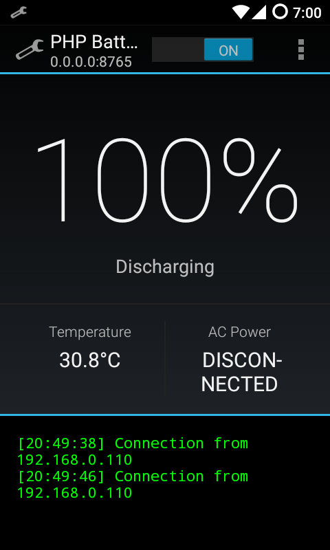
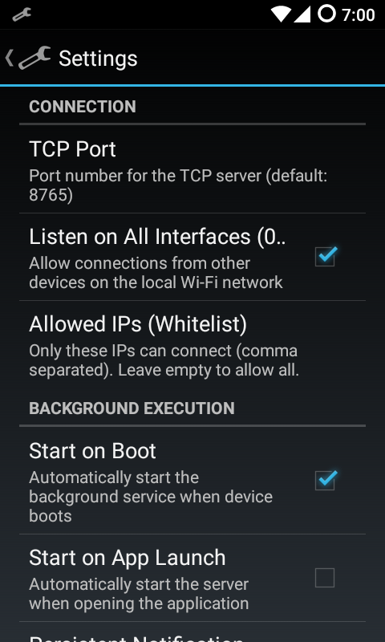
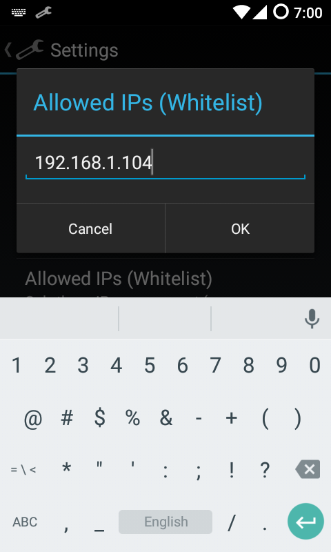
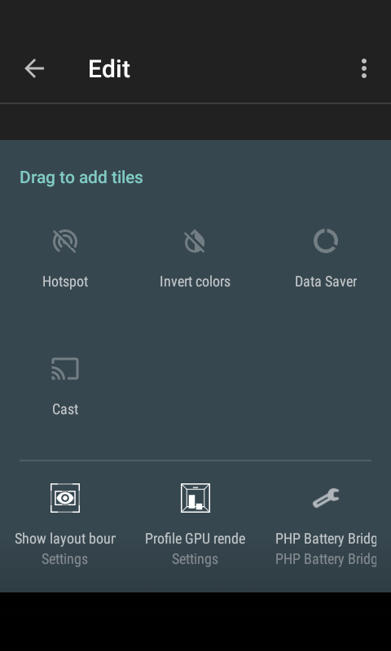
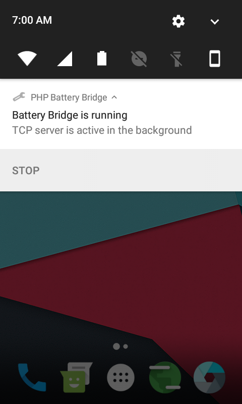
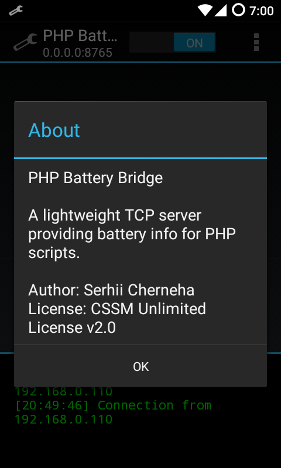

# PHP Battery Bridge (Android)

[](https://github.com/ChernegaSergiy/android-battery-bridge/actions/workflows/build.yml)

A specialized Android application that exposes real-time battery information to PHP extensions via IPC. It implements a simple TCP Socket Server and sends battery data (level, charging status, health, temperature, voltage, technology) in JSON format when a client connects.

## Screenshots

| Dashboard & Terminal | Settings |
| :---: | :---: |
|  |  |
| **IP Whitelist** | **Quick Settings Tile** |
|  |  |
| **Persistent Notification** | **About Dialog** |
|  |  |

## Architecture

This implements a direct TCP Server approach:

1. **Android App runs a local TCP server** on a configurable port (default `8765`), bound to `127.0.0.1` or all interfaces (`0.0.0.0`).
2. **PHP connects** to the configured IP and port.
3. **Android App sends** the battery data in JSON format and immediately closes the connection.

## Components

- **ui**
  - **MainActivity** — minimal UI to monitor server status
  - **SettingsActivity** — handles app configuration and broadcasts changes
  - **ServerStatusObserver** — listens to background service state
  - **NotificationHelper** — manages foreground service notifications
- **service**
  - **BatteryService** — background orchestrator that binds the server and data provider
- **network**
  - **TcpServer** — pure socket logic that accepts client connections
- **data**
  - **BatteryDataProvider** — extracts and formats battery telemetry
  - **SettingsRepository** — encapsulates `SharedPreferences` access
- **receiver**
  - **BootReceiver** — automatically starts the service on device boot

## IPC Protocol

Simply connect via TCP to the configured IP (default `127.0.0.1`) on the configured port (default `8765`).

Response JSON:
```json
{"l":85,"c":1,"h":1,"t":25,"v":4200,"tech":"Li-ion"}
```

| Field | Description |
|-------|-------------|
| `l` | Battery level (0-100) |
| `c` | Charging status (1/0) |
| `h` | Health status |
| `t` | Temperature (tenths of degree Celsius) |
| `v` | Voltage (mV) |
| `tech` | Battery technology string |

## Building

### Prerequisites

- Android SDK (`ANDROID_HOME`)
- Gradle (optional, wrapper included)

### Build APK

```sh
cd android-battery-bridge

# Using Gradle wrapper (recommended)
./gradlew assembleDebug

# Or using system Gradle
gradle assembleDebug
```

APK will be at: `app/build/outputs/apk/debug/app-debug.apk`

### Install on Device

```sh
adb install app/build/outputs/apk/debug/app-debug.apk
```

## Usage

After installing the APK, open the app once to register it in the launcher. The app will start a background service listening for TCP connections on the configured port (default 8765). You can use the app's settings menu to change the port or allow connections from other devices on your network.

This bridge is primarily designed to be consumed by the [battery_info PHP extension](https://github.com/ChernegaSergiy/battery-php-ext), which will automatically connect to this port to read the device's battery status when running in CLI environments like Termux.

## Contributing

Contributions are welcome and appreciated! Here's how you can contribute:

1. Fork the project
2. Create your feature branch (`git checkout -b feature/AmazingFeature`)
3. Commit your changes (`git commit -m 'Add some AmazingFeature'`)
4. Push to the branch (`git push origin feature/AmazingFeature`)
5. Open a Pull Request

Please make sure to update tests as appropriate and adhere to the existing coding style.

## License

This project is licensed under the CSSM Unlimited License v2.0 (CSSM-ULv2). See the [LICENSE](LICENSE) file for details.
